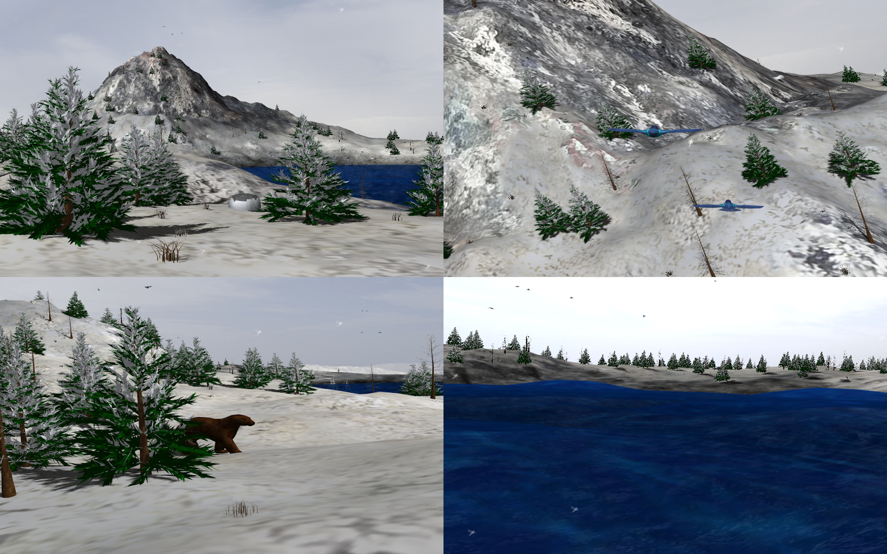

# OpenGL-Winter

This repository contains the implementation of an interactive winter 3D scene in C++ using OpenGL. The scene contains a mountain terrain, a skydome, a forest, a lake, an animated bear, animated birds and simulated snow.



Video:

[](https://www.youtube.com/watch?v=CTcpMGE0bRU&feature=youtu.be)

The base of the vcl directory taken from École Polytechnique's INF443 course code base: <https://github.com/drohmer/inf443_vcl>.

## Installation & Build

Installing GLFW:

```c
sudo apt install libglfw3-dev
```

Compilation:
```c
mkdir build
cd build
cmake ..
make
```

This generates binary files in the `bin` directory.
